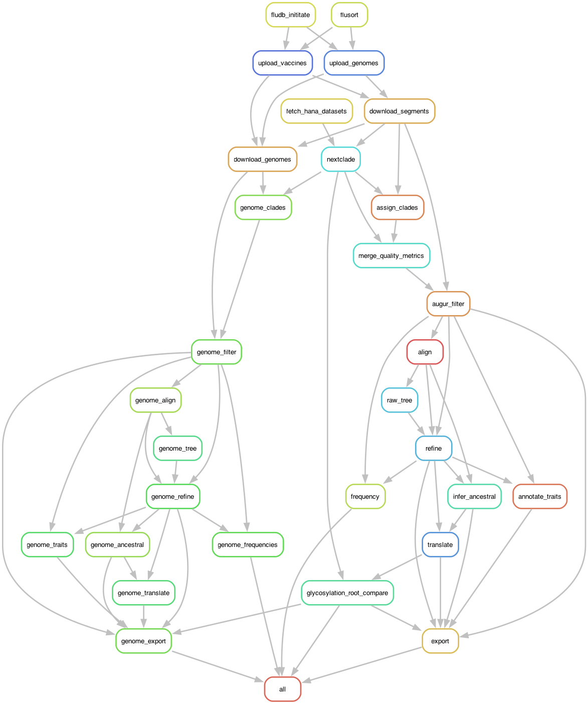

# Pekosz Lab Seasonal Influenza Nextstrain Builds 🦠

This repository contains the scripts, Snakefiles, and configuration files used for the [Pekosz Lab Nextstrain builds](https://nextstrain.org/groups/PekoszLab) in [JH-CEIRR](https://www.ceirr-network.org/centers/jh-ceirr).

- Builds are currently maintained for all 8 segments of circulating H1N1, H3N2, and B/Victoria viruses detected through the Johns Hopkins Hospital (JHH) Network.
- Three concatenated genome builds are also maintained for H1N1, H3N2, and B/Victoria viruses.
- As of [2024-11-26](#history), all builds are constructed using a simplified [Snakemake](https://snakemake.readthedocs.io/en/stable/) pipeline.

---

# Table of Contents

- [START HERE: Getting Started with the 24 Segment Build for H1N1, H3N2, and B/Victoria](#quickstart-getting-started-with-the-24-segment-build-for-h1n1-h3n2-and-bvictoria)
  - [1. Clone This Repository, Set Up, and Activate Your Environment](#1-clone-this-repository-set-up-and-activate-your-environment)
  - [2. Access Genome and Metadata Files from JHH and GISAID](#2-access-genome-and-metadata-files-from-jhh-and-gisaid)
  - [3. Build All 27 Influenza Segment and Genome Builds Using Snakemake](#3-build-all-27-influenza-segment-and-genome-builds-using-snakemake)
  - [4. Upload the Builds to Nextstrain](#4-upload-the-builds-to-nextstrain)
    - [Optional Spot Check: View Builds Locally with Auspice](#optional-spot-check-view-builds-locally-with-auspice)
    - [Upload Builds to the Private Repository for Testing](#upload-builds-to-the-private-repository-for-testing)
    - [Verify Build Upload](#verify-build-upload)
    - [Upload a Single Build `.json`](#upload-a-single-build-json)
  - [5. Build Internal Reports](#5-build-internal-reports)
  - [6. Create a Build Snapshot and Clean the Working Directory](#6-create-a-build-snapshot-and-clean-the-working-directory)
    - [What This Rule Does](#what-this-rule-does)
    - [How to Run the `snapshot_clean` Rule](#how-to-run-the-snapshot_clean-rule)
    - [Example Output Structure](#example-output-structure)
- [Pekosz Lab Nextstrain Roadmap](#pekosz-lab-nextstrain-roadmap)
- [Build DAG Rulegraph Overview](#build-dag-rulegraph-overview)
- [Clade Calling and Quality Control](#clade-calling-and-quality-control)
  - [1. Download and Assign Clades with Nextclade](#1-download-and-assign-clades-with-nextclade)
  - [2. Propagate HA Clade Assignments](#2-propagate-ha-clade-assignments)
  - [3. Append Segment-Specific Quality Metrics](#3-append-segment-specific-quality-metrics)
  - [4. Filter Sequences](#4-filter-sequences)
  - [5. Run Standard Nextstrain Build Steps](#5-run-standard-nextstrain-build-steps)
- [Tutorial: Add Vaccine Strains from GISAID](#tutorial-add-vaccine-strains-from-gisaid) (for current maintainers)
  - [Overview](#overview)
  - [Required Output File](#required-output-file)
  - [Step 1: Navigate to GISAID](#step-1-navigate-to-gisaid)
  - [Step 2: Create a GISAID Workset for Vaccine Strains](#step-2-create-a-gisaid-workset-for-vaccine-strains)
  - [Step 3: Navigate to Vaccine Reference Sequences](#step-3-navigate-to-vaccine-reference-sequences)
  - [Step 4: Add Vaccine Strain Segments to the Workset](#step-4-add-vaccine-strain-segments-to-the-workset)
  - [Step 5: Download Vaccine FASTA Sequences](#step-5-download-vaccine-fasta-sequences)
  - [Step 6: Critically, Reformat Vaccine FASTA Headers](#step-6-critically-reformat-vaccine-fasta-headers)
  - [Required Vaccine FASTA Header Format](#required-vaccine-fasta-header-format)
  - [Example Vaccine FASTA Header](#example-vaccine-fasta-header)
  - [Important Notes About Vaccine Headers](#important-notes-about-vaccine-headers)
  - [Step 7: Save the Reformatted Vaccine FASTA File](#step-7-save-the-reformatted-vaccine-fasta-file)
  - [Step 8: Confirm the File Is Available to the Pipeline](#step-8-confirm-the-file-is-available-to-the-pipeline)
- [Acknowledgements](#acknowledgements)

---


# START HERE: Getting Started with the 24 Segment Build for H1N1, H3N2, and B/Victoria

> [!WARNING]
> For this tutorial, all scripts must be run from the `nextstrain/` home directory.

---

## 1. Clone This Repository, Set Up, and Activate Your Environment

> [!NOTE]
> Dependencies for this build are maintained through `conda`. Download the latest version [here](https://anaconda.org/anaconda/conda).
>
> A brief introduction to `conda` and `conda environments` is available [here](https://docs.conda.io/projects/conda/en/latest/user-guide/getting-started.html).

Clone the repository:

```shell
git clone https://github.com/Pekosz-Lab/nextstrain.git
```

Navigate to the repository directory:

```shell
cd nextstrain
```

Install a Nextstrain Runtime by following the instructions listed on their [website](https://docs.nextstrain.org/en/latest/install.html). This build has been verified to run using in Docker and Conda runtimes 

> [!NOTE]
>  `blastn` is required to assign type and subtypes for ingested segments and must be installed manually. `blastn` installation instructions are available from [NCBI](https://blast.ncbi.nlm.nih.gov/Blast.cgi?PAGE_TYPE=BlastDocs&DOC_TYPE=Download) and [Bioconda](https://anaconda.org/bioconda/blast).


[Verify](https://docs.nextstrain.org/projects/cli/en/stable/commands/check-setup/) your Nextstrain Runtime

```shell
nextstrain check-setup 
```

Activate the Nextstrain Shell

```shell
Nextstrain shell .
```

---

## 2. Access Genome and Metadata Files from JHH and GISAID

Create the required `source/`, `data/`, and `results/` directories within the `nextstrain/` directory:

```shell
mkdir source data results
```

Populate the `source/` folder with the following required files:

1. `JHH_sequences.fasta`
2. `JHH_metadata.tsv`
3. `vaccines.fasta`

Contact Dr. Heba Mostafa and Dr. Andy Pekosz to access the [source folder data](https://livejohnshopkins-my.sharepoint.com/:f:/r/personal/hmostaf2_jh_edu/Documents/Influenza-Surveillance?csf=1&web=1&e=2sny2s).

The `vaccines.fasta` file is manually downloaded and updated directly from GISAID. See [Tutorial: Add Vaccine Strains from GISAID](#tutorial-add-vaccine-strains-from-gisaid) for detailed instructions.

Download all data in the `source/` folder, or overwrite your existing `source/` folder, and move it to the repository head directory, `nextstrain/`.

Your `nextstrain/` directory should now contain the following additional folders and files:

```text
nextstrain/
├── source/
│   ├── JHH_metadata.tsv
│   ├── JHH_sequences.fasta
│   ├── vaccines.fasta
│   └── vaccines.tsv
├── data/    # This will be empty
└── results/ # This will be empty
```

> [!WARNING]
> These builds are designed to ingest influenza genome data and metadata obtained from sources with regulated access.
>
> Access to all GISAID data requires individual user credentials, which cannot be shared publicly.
>
> Additionally, influenza genome data from the Johns Hopkins Hospital Network that were accessed before release on GISAID are private and cannot be shared publicly through this repository.

---

## 3. Build All 27 Influenza Segment and Genome Builds Using Snakemake

As of [`9478cb9`](https://github.com/Pekosz-Lab/nextstrain/commit/eed94b43713a34d8e18a9ea030e0d9b1450c0f42), manual curation and organization of input `sequence.fasta` and `metadata.tsv` files is no longer necessary.

An ingest Snakemake rule has been constructed to automate the following tasks for all 24 segment builds for H1N1, H3N2, and B/Victoria:

- Segment typing and subtyping using [flusort](scripts/flusort)
- Uploading all genomes and metadata to [fludb](fludb/), including vaccine strains
- Generating all build datasets in the `data/` directory using [`download.py`](fludb/scripts/download.py)

From the `nextstrain/` directory, execute the following command to construct all builds:

```shell
snakemake --cores 8
```


---

## 4. Upload the Builds to Nextstrain

### Optional Spot Check: View Builds Locally with Auspice

Before uploading, you can inspect the builds locally with Auspice:

```shell
auspice view --datasetDir auspice/h1n1

auspice view --datasetDir auspice/h3n2

auspice view --datasetDir auspice/vic
```

If everything looks correct, proceed with uploading the builds to:

```text
nextstrain.org/groups/PekoszLab
```

---

### Upload Builds to the Private Repository for Testing

```shell
python scripts/nextstrain_upload_private_genomes.py
```

---

### Verify Build Upload

```shell
nextstrain remote list nextstrain.org/groups/PekoszLab
```

---

### Upload a Single Build `.json`

Replace `${YOUR_BUILD_NAME}` with the file name of the build, along with any additional [sidecar](https://docs.nextstrain.org/en/latest/reference/data-formats.html) files you want to upload.

```shell
nextstrain remote upload \
    nextstrain.org/groups/PekoszLab/${YOUR_BUILD_NAME} \
    auspice/${YOUR_BUILD_NAME}.json
```

---

## 5. Build Internal Reports

> [!NOTE]
> You can safely generate reports **before running the `snapshot_clean` rule**.
>
> The `reports/` folder will be archived automatically during the snapshot process.

After all builds are complete, summary reports can be generated with the following command:

```shell
python scripts/build-reports.py \
   -i fludb.db \
   -o reports/report.tsv \
   -e reports/report.xlsx \
   -h1 results/h1n1/ha/metadata.tsv \
   -h3 results/h3n2/ha/metadata.tsv \
   -b results/vic/ha/metadata.tsv
```

Once the summary data are generated, render the formatted HTML report using Quarto:

```shell
quarto render scripts/render-reports.qmd --to html --output-dir ../reports/
```

The rendered report will be saved in the `reports/` folder and can be viewed in any web browser.

---

## 6. Create a Build Snapshot and Clean the Working Directory

> [!WARNING]
> Before starting a new build with updated data, you **must** run this rule.
>
> It will **archive your current results** and **clean the workspace** to prepare for a fresh build.

### What This Rule Does

When executed, the `snapshot_clean` rule:

1. Creates a timestamped backup folder inside `snapshots/`, for example:

   ```text
   snapshots/20251111T163000/
   ```

2. Copies the following directories, if they exist:

   ```text
   auspice/
   logs/
   reports/
   source/
   ```

3. Compresses the snapshot into a `.tar.gz` archive.
4. Deletes temporary working folders:

   ```text
   data/
   results/
   logs/
   reports/
   ```

5. Removes the database file:

   ```text
   fludb.db
   ```

---

### How to Run the `snapshot_clean` Rule

You have two options for triggering the `snapshot_clean` rule.

#### Option 1: Run Manually

Use this option when you only want to clean and archive the current build:

```shell
snakemake --cores 8 snapshot_clean
```

#### Option 2: Run Automatically After a Successful Build

Use this option if you have added `snapshot_clean` to the main pipeline and want it to run automatically at the end:

```shell
snakemake --configfile config.yaml --config run_snapshot_clean=true --cores 8
```

This approach is recommended if you want every completed build to automatically save a snapshot before cleanup.

---

### Example Output Structure

After running the rule, a compressed snapshot of your previous build will be saved in the `snapshots/` folder:

```text
snapshots/
└── 20251111T163000.tar.gz
```

---

# Pekosz Lab Nextstrain Roadmap

- [ ] Automated [report generation](scripts/report-html-pdf.qmd) for all builds.
- [ ] Add t-SNE implementation for all builds using [pathogen-embed](https://pypi.org/project/pathogen-embed/).
  - Manuscript: <https://bedford.io/papers/nanduri-cartography/>
- [x] Automated concatenated genome builds for H1N1 and H3N2.
  - Implemented in `9478cb9`.

---

# Build DAG Rulegraph Overview

Generate the rulegraph with:

```shell
snakemake --rulegraph | dot -Tpng > rulegraph.png
```

Below is a simplified representation of the rules implemented for each build.

Because wildcard constraints have been defined by subtype and segment, this general rulegraph is executed for H1N1, H3N2, and B/Victoria for all 8 segments, along with the 3 concatenated genome builds.



---

# Clade Calling and Quality Control

## 1. Download and Assign Clades with Nextclade

The pipeline automatically downloads the latest Nextclade dataset with each build, ensuring that clade and subclade assignments remain current.

### Why Use Nextclade Instead of `augur clades`?

This approach differs from the standard Nextstrain workflow and may be open to discussion. However, Nextclade offers several advantages:

- **Comprehensive QC metrics**: Provides an appendable table with multiple [quality control metrics](https://docs.nextstrain.org/projects/nextclade/en/stable/user/algorithm/06-quality-control.html), including:
  - Missing data
  - Problematic sites
  - Private mutations
  - Mutation clusters
  - Frameshifts
  - Stop codons

- **Metadata-centric workflow**: Stores clade information directly in metadata, eliminating the need for a separate `augur clades` step.

- **Built-in glycosylation prediction**: Includes glycosylation site prediction functionality.

- **Flexible filtering**: QC metrics can be filtered downstream using [`augur filter`](https://docs.nextstrain.org/projects/augur/en/stable/usage/cli/filter.html) and can inform qualitative decisions during analysis.

This approach is open for discussion. See the [`augur clades` documentation](https://docs.nextstrain.org/projects/augur/en/stable/usage/cli/clades.html) for additional context.

---

## 2. Propagate HA Clade Assignments

HA clade assignments are appended to metadata for all segments.

---

## 3. Append Segment-Specific Quality Metrics

Quality control metrics are added to each segment's metadata.

---

## 4. Filter Sequences

Sequences are filtered by coverage, QC status, and length using [`augur filter`](https://docs.nextstrain.org/projects/augur/en/stable/usage/cli/filter.html).

```shell
"--query", "(coverage >= 0.9) & (`qc.overallStatus` == 'good')",  # Add qc_overallStatus == 'mediocre' if needed
"--min-length", str(min_length),
```

---

## 5. Run Standard Nextstrain Build Steps

After filtering, the pipeline runs the standard build steps:

1. Align sequences
2. Build the raw tree
3. Refine branches
4. Annotate
5. Infer ancestral sequences
6. Translate sequences
7. Export in Auspice V2 format
8. Upload and deploy the builds to [Nextstrain](https://nextstrain.org/groups/PekoszLab)

---


# Tutorial: Add Vaccine Strains from GISAID

This section describes how to download seasonal influenza vaccine reference sequences from GISAID and prepare them for use in the Pekosz Lab Nextstrain pipeline.

> [!IMPORTANT]
> Vaccine strain FASTA headers **must be manually reformatted** before running the pipeline.
>
> The ingest workflow expects vaccine headers to follow a specific format. If the headers are not formatted correctly, the vaccine strains may fail to upload to `fludb`, may be assigned incorrect metadata, or may be excluded from downstream builds.

## Overview

Vaccine strain sequences are downloaded manually from GISAID and saved in the repository as:

```text
source/vaccines.fasta
```

These sequences are parsed during the ingest step by:

```text
fludb/scripts/upload_vaccine.py
```

This script is called from the ingest workflow:

```text
workflow/snakemake_rules/ingest.smk
```

Unlike clinical strain headers, vaccine strain headers include passage history information directly in the strain name. This is intentional and required for the current vaccine ingest workflow.

---

## Required Output File

After downloading and reformatting vaccine sequences, the final FASTA file should be saved as:

```text
source/vaccines.fasta
```

The file should contain all vaccine strain segments that should be included in the builds.

---

## Step 1: Navigate to GISAID

1. Go to the GISAID website.
2. Log in using your individual GISAID credentials.

> [!WARNING]
> GISAID access requires individual user credentials.
>
> Credentials and downloaded GISAID data must not be shared publicly or committed to this repository.

---

## Step 2: Create a GISAID Workset for Vaccine Strains

This step is optional but recommended.

Create a GISAID workset named:

```text
seasonal influenza vaccine strains
```

Using a dedicated workset makes it easier to:

- Track which vaccine strains have already been selected
- Download multiple vaccine strain segments together
- Update the `vaccines.fasta` file during future build cycles
- Avoid accidentally mixing vaccine references with clinical sequences

---

## Step 3: Navigate to Vaccine Reference Sequences

Within GISAID, navigate to:

```text
Vaccine Reference Sequences
```

This section contains seasonal influenza vaccine reference strains.

---

## Step 4: Add Vaccine Strain Segments to the Workset

For each vaccine strain that should be included in the build:

1. Click on the strain name or accession number.
2. In the strain menu, locate the **Sequence** section.
3. Select all available segments for that strain.
4. Click **Copy to**.
5. Add the selected sequences to the workset:

   ```text
   seasonal influenza vaccine strains
   ```

Alternatively, you may download each segment one at a time. However, adding strains to a workset first is recommended because it reduces the chance of missing individual segments.

> [!NOTE]
> Influenza viruses have 8 genome segments. When possible, select all available segments for each vaccine strain so the pipeline can include vaccine references across segment-specific builds.

---

## Step 5: Download Vaccine FASTA Sequences

After adding vaccine strain segments to the workset:

1. Open the workset.
2. Confirm that the expected vaccine strains and segments are present.
3. Download the sequences in FASTA format.

The downloaded file from GISAID will need to be manually edited before it can be used by the pipeline.

---

## Step 6: Critically, Reformat Vaccine FASTA Headers

> [!CAUTION]
> This is the most important step in the vaccine strain update process.
>
> Before running the pipeline, users **must change every vaccine FASTA header** to match the exact format described below.

The vaccine FASTA header is parsed during the ingest step by:

```text
fludb/scripts/upload_vaccine.py
```

which is called from:

```text
workflow/snakemake_rules/ingest.smk
```

If the header fields are missing, out of order, or separated incorrectly, vaccine metadata may be parsed incorrectly.

---

## Required Vaccine FASTA Header Format

Each vaccine FASTA header must include the following fields in the exact order shown below:

```text
>Isolate name-Passage details/history | Isolate ID | Collection date | Passage details/history | Segment number | Type | Lineage
```

The required fields are:

1. `Isolate name-Passage details/history`
2. `Isolate ID`
3. `Collection date`
4. `Passage details/history`
5. `Segment number`
6. `Type`
7. `Lineage`

Fields must be separated by pipe characters:

```text
|
```

Spaces around the pipe characters are allowed and recommended for readability:

```text
field 1 | field 2 | field 3 | field 4 | field 5 | field 6 | field 7
```

---

## Example Vaccine FASTA Header

Example format:

```text
>A/Wisconsin/67/2022-E2/E3 | EPI_ISL_XXXXXXXX | 2022-03-15 | E2/E3 | 4 | A | H1N1
```

Example with a sequence:

```text
>A/Wisconsin/67/2022-E2/E3 | EPI_ISL_XXXXXXXX | 2022-03-15 | E2/E3 | 4 | A | H1N1
ATG...TAA
```

> [!NOTE]
> The above example is illustrative. Use the correct isolate name, isolate ID, collection date, passage history, segment number, type, and lineage from GISAID for each downloaded sequence.

---

## Important Notes About Vaccine Headers

Vaccine headers are unique compared to clinical strain headers because passage history information is included in the strain name.

Specifically, the first field should be:

```text
Isolate name-Passage details/history
```

For example:

```text
A/Wisconsin/67/2022-E2/E3
```

The fourth field should also contain the passage details/history as its own metadata field:

```text
E2/E3
```

Therefore, a correctly formatted vaccine header includes passage history twice:

1. Once appended to the isolate name in field 1
2. Once as the standalone passage history field in field 4

This formatting is required because the vaccine ingest script parses vaccine records differently from clinical strain records.

> [!IMPORTANT]
> Do not remove passage history from the vaccine strain name.
>
> The vaccine strain name should include passage history using the format:
>
> ```text
> Isolate name-Passage details/history
> ```

---

## Step 7: Save the Reformatted Vaccine FASTA File

After all vaccine sequence headers have been reformatted, save the file as:

```text
source/vaccines.fasta
```

If a previous `vaccines.fasta` file already exists, replace it only after confirming that the updated file contains all vaccine strains and segments needed for the current build.

Recommended checks before saving:

- Every FASTA record has a header beginning with `>`.
- Every header has exactly 7 fields.
- Fields are separated by `|`.
- The fields are in the required order.
- The first field includes both isolate name and passage details/history.
- The fourth field contains passage details/history.
- Segment numbers are present.
- Type is included, for example `A` or `B`.
- Lineage is included, for example `H1N1`, `H3N2`, or `Victoria`.

---

## Step 8: Confirm the File Is Available to the Pipeline

Before running the build, confirm that the file exists:

```shell
ls source/vaccines.fasta
```

You can also inspect the headers with:

```shell
grep "^>" source/vaccines.fasta
```

Once `source/vaccines.fasta` is present and correctly formatted, continue with the normal build process.

---


# Acknowledgements

Automation with Snakemake has increased the efficiency of these builds.

The structure, scripts, and configuration files herein are strongly inspired by the [seasonal-flu](https://github.com/nextstrain/seasonal-flu) build maintained by the Nextstrain team.