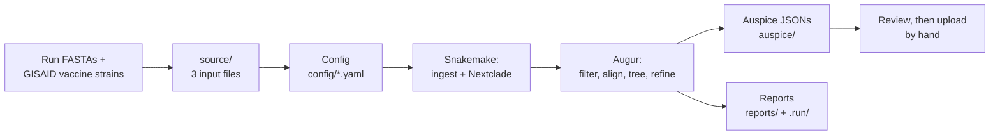

# Pekosz Lab Seasonal Influenza Nextstrain Builds 🦠

This repository turns influenza sequences from the Johns Hopkins Hospital
(JHH) network into [Nextstrain](https://nextstrain.org) builds for
[JH-CEIRR](https://www.ceirr-network.org/centers/jh-ceirr): 24 segment builds
(all 8 segments of H1N1, H3N2 and B/Victoria), 3 whole-genome builds, and a
surveillance report. One Snakemake command runs everything, so the lab can
track circulating clades season after season.

**Live builds:** 

- [nextstrain.org/groups/PekoszLab](https://nextstrain.org/groups/PekoszLab) (lab members) ·
- [nextstrain.org/groups/PekoszLab-Public](https://nextstrain.org/groups/PekoszLab-Public) (public)

> [!TIP]
> 📖 **Full documentation lives on the [Wiki](https://github.com/Pekosz-Lab/nextstrain/wiki)**:
> setup, step-by-step guides, tutorials, best practices and data rules.


```mermaid
flowchart LR
    A["Run FASTAs +<br/>GISAID vaccine strains"] --> B["source/<br/>3 input files"]
    B --> C["Config<br/>config/*.yaml"]
    C --> D["Snakemake:<br/>ingest + Nextclade"]
    D --> E["Augur:<br/>filter, align, tree, refine"]
    E --> F["Auspice JSONs<br/>auspice/"]
    E --> G["Reports<br/>reports/ + .run/"]
    F --> H["Review, then upload<br/>by hand"]
```

## Clone & get started

1. install [conda](https://docs.conda.io/projects/conda/en/latest/user-guide/install/index.html)

2. in your terminal execute: 

```shell
git clone https://github.com/Pekosz-Lab/nextstrain.git && cd nextstrain
bash scripts/build_env.sh               # environment + checks + data-protection hooks
conda activate pekosz-nextstrain
snakemake --profile profiles/default --cores 8 --configfile config/tutorial.yaml
```

That runs the practice dataset. Details and real data:
[Getting Started](https://github.com/Pekosz-Lab/nextstrain/wiki/Getting-Started) →
[Tutorial 1](https://github.com/Pekosz-Lab/nextstrain/wiki/Tutorial-1-Your-First-Build).

> [!IMPORTANT]
> This repository is public and contains **no data**. It processes licensed
> GISAID sequences and unpublished JHH sequences, which must never be
> committed or shared. Read
> [Data Protection](https://github.com/Pekosz-Lab/nextstrain/wiki/Data-Protection)
> before using real data. AI coding agents follow [`.agents/AGENTS.md`](.agents/AGENTS.md).

Cite this software with [`CITATION.cff`](CITATION.cff). Inspired by the
Nextstrain team's [seasonal-flu](https://github.com/nextstrain/seasonal-flu) build.
