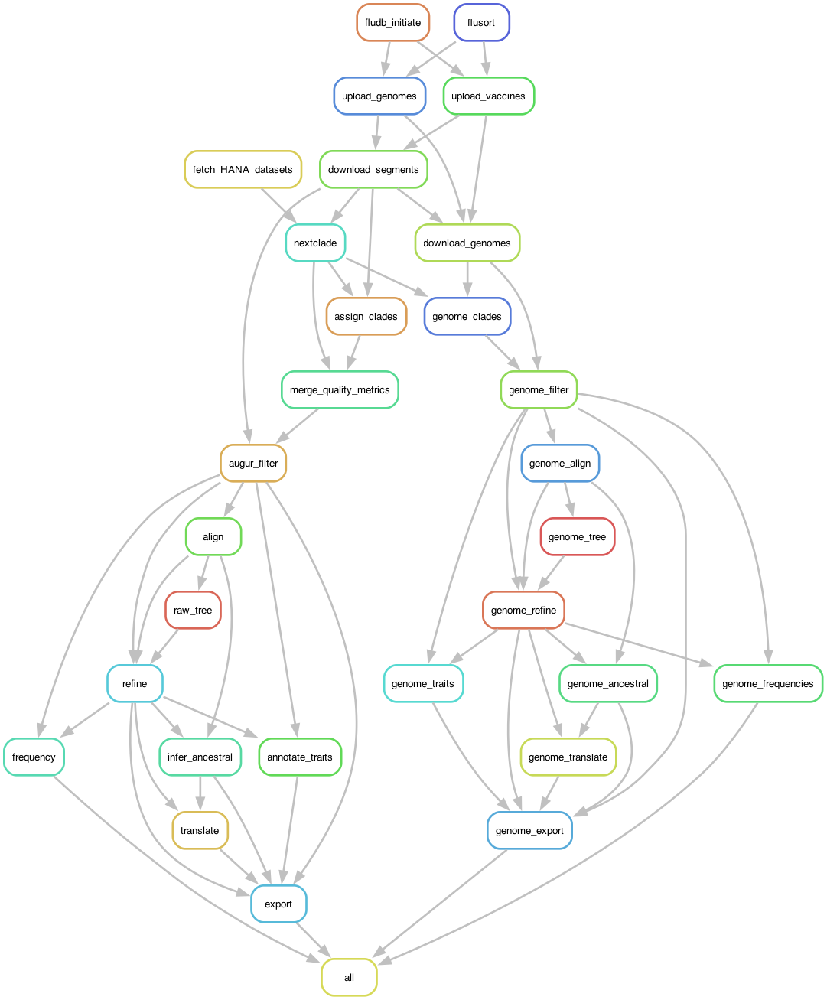

# Pekosz Lab Seasonal Influenza Nextstrain Builds 🦠 

This repository houses all scripts, snakefiles, and configuration files for the [Pekosz Lab nextstrain builds](https://nextstrain.org/groups/PekoszLab) in [JH-CEIRR](https://www.ceirr-network.org/centers/jh-ceirr).

- Currently, builds are maintained for all 8 segments of circulating H1N1, H3N2, and B/Vic viruses detected through the Johns Hopkins Hospital (JHH) Network. 

- 3 concatenated genome builds are also maintained for H1N1, H3N2, and B/Vic viruses.

- As of [2024-11-26](#history), all builds are constructed using a simplified [snakemake](https://snakemake.readthedocs.io/en/stable/) pipeline.

# Quickstart: Getting Started with the 24 segment build for H1N1, H3N2 and B/Victoria

>[!WARNING]
>For this tutorial, all scripts must be run from the `nextstrain/` home directory. 


## 1. Clone this repository setup and activate your environment. 

>[!NOTE]
> Dependencies for this build are maintained through `conda`. Download the latest version [here](https://anaconda.org/anaconda/conda). A brief introduction to `conda` and `conda environments` can be found [here](https://docs.conda.io/projects/conda/en/latest/user-guide/getting-started.html).

- Clone: `git clone https://github.com/Pekosz-Lab/nextstrain.git`

- Navigate to the head directory `cd nextstrain`

- Build the environment and base dependencies `conda env create -f workflow/envs/environment.yml`

> [!Note]
> The included environment.yml attempts to install blastn and iqtree2 through conda-forge. If you encounter issues with these packages, please install them manually. 
> blastn installation instructions can be found [here](https://blast.ncbi.nlm.nih.gov/Blast.cgi?PAGE_TYPE=BlastDocs&DOC_TYPE=Download) and here via [bioconda](https://anaconda.org/bioconda/blast)
> iqtree2 installation instructions can be found [here](http://www.iqtree.org)

- Activate the environment `conda activate pekosz-nextstrain`

## 2. Access genome and metadata from JHH and GISAID (vaccine strains) and place in a directory called `source/`

- Create the `source`, `data` and `results` directories within the `nextstrain/` directory. 

```
mkdir source data results
```

- Populate the `source/` folder with the following files:

1. JHH_sequences.fasta
2. JHH_metadata.tsv
3. vaccines.fasta

The Contact Dr. Heba Mostafa and Dr. Andy Pekosz to access the [source folder data](https://livejohnshopkins-my.sharepoint.com/:f:/r/personal/hmostaf2_jh_edu/Documents/Influenza-Surveillance?csf=1&web=1&e=2sny2s). The `vaccines.fasta` file is manually downloaded and updated directly from GISAID. 

Download the all data in the `source/` folder or overwrite your source folder and moving it to the repo head directory `nextstrain/`. You `nextstrain` directory will now have the following additional folders: 

```

nextstrain/
├── source/
   ├── GISAID_metadata.xls
   ├── GISAID_sequences.fasta
   ├── JHH_metadata.tsv
   ├── JHH_sequences.fasta
   ├── vaccines.fasta
   └── vaccines.tsv
├── data/ # This will be empty
├── results/ # This will be empty
```

>[!WARNING]
>These builds are designed to ingest influenza genome data and metadata obtained from sources with regulated access. Access to all GISAID data requires individual user credentials, which cannot be shared publicly. Additionally, influenza genome data from the Johns Hopkins Hospital (JHH) network that were accessed prior to their release on GISAID are private and cannot be shared publicly through this repository.

## 3. Build all 27 influenza segment and genome builds using Snakemake

As of [9478cb9](https://github.com/Pekosz-Lab/nextstrain/commit/eed94b43713a34d8e18a9ea030e0d9b1450c0f42), manual curation and organization of input sequence.fasta and metadata.tsv files is no longer necessary. An ingest snakemake rule has been constructed to automate the following tasks for all 24 segment builds for H1N1, H3N2, and B/Victoria:
- Segment typing and subtyping using [flusort](scripts/flusort)
- uploading all genomes and metadata to [fludb](fludb/), including vaccine strains
- generation of all build datasets in the `data/` directory using [download.py](fludb/scripts/download.py)

From the `nextstrain/` directory execute the following to initiate the construction of all builds. 

```
snakemake --cores 8
```

## 4. Upload the builds to nextstrain

### Optional Spot check - view on local auspice 

```
auspice view --datasetDir auspice/h1n1

auspice view --datasetDir auspice/h3n2

auspice view --datasetDir auspice/vic
```

If all looks good, proceed to upload the builds to nextstrain.org/groups/PekoszLab


### Uploading builds to the private repository for testing

```shell
python scripts/nextstrain_upload_private_genomes.py
```

#### Verify Build Upload

```shell
nextstrain remote list nextstrain.org/groups/PekoszLab
```

### Uploading a single build `.json` 

Replace `${YOUR_BUILD_NAME}` with the file name of the build along with any additional [sidecar](https://docs.nextstrain.org/en/latest/reference/data-formats.html) files you desire to upload.

```shell
nextstrain remote upload \
    nextstrain.org/groups/PekoszLab/${YOUR_BUILD_NAME} \
    auspice/${YOUR_BUILD_NAME}.json
```

# 5. Building Internal Reports

> [!NOTE]  
> You can safely generate reports **before running the `snapshot_clean` rule** — the `reports/` folder will be archived automatically during the snapshot process.

Following the execution of all builds, summary reports can be generated using the following commands:

```
python scripts/build-reports.py \
   -i fludb.db \
   -o reports/report.tsv \
   -e reports/report.xlsx \
   -h1 results/h1n1/ha/metadata.tsv \
   -h3 results/h3n2/ha/metadata.tsv \
   -b results/vic/ha/metadata.tsv
```

Once the summary data are generated, you can render the formatted HTML report using Quarto:
```
quarto render scripts/report-reports.qmd --to html --output-dir ../reports/
```
The rendered report will be saved in the reports/ folder and can be viewed in any web browser.

# 6. Create a Build Snapshot and Clean the Working Directory

> [!WARNING] 
> Before starting a new build with updated data, you **must** run this rule.  
> It will **archive your current results** and **clean the workspace** to prepare for a fresh build.

### What this rule does
When executed, the rule:

1. Creates a timestamped backup folder inside `snapshots/` (e.g., `snapshots/20251111T163000/`).
2. Copies the following directories (if they exist):  
   `auspice/`, `logs/`, `reports/`, and `source/`.
3. Compresses the snapshot into a `.tar.gz` archive.
4. Deletes temporary working folders (`data/`, `results/`, `logs/`, `reports/`) and removes the database file `fludb.db`.

### 🧭 How to run it

You have **two ways** to trigger the `snapshot_clean` rule:

#### Option 1 — Run manually
Use this when you only want to clean and archive the current build:

```bash
snakemake --cores 8 snapshot_clean 
```

#### Option 2 — Run automatically after a successful build

Use this if you’ve added snapshot_clean to the main pipeline and want it to run automatically at the end:

```
snakemake --configfile config.yaml --config run_snapshot_clean=true --cores 8
```

This approach is recommended if you want every completed build to automatically save a snapshot before cleanup.

📁 Example output structure
After running the rule, you’ll find a compressed snapshot of your previous build in the snapshots/ folder:

```
snapshots/
├── 20251111T163000.tar.gz
```

# Peskoz Lab Nextstrain Roadmap

- [ ] Automated [report generation](scripts/report-html-pdf.qmd) for all builds.
- [ ] Add t-SNE implementation for all builds using [pathogen-embed](https://pypi.org/project/pathogen-embed/).
   - Manuscript: https://bedford.io/papers/nanduri-cartography/
- [X] Automated concatenated genome builds for h1n1 and h3n2 - Implemented in 9478cb9.

# Build DAG Rulegraph Overview. 

`snakemake --rulegraph | dot -Tpng > rulegraph.png`

Below is a simplified representation of the rules implemented for each build. Because wildcard constraints have been defined by subtype and segment, this general rulegraph is executed for h1n1, h3n2, and vic for all 8 segments along with the 3 concatenated genome builds. 



## How is clade calling and quality control performed in this pipeline?

## How does this pipeline perform clade calling and quality control?

### 1. Download and assign clades with Nextclade

The pipeline automatically downloads the latest Nextclade dataset with each build, ensuring clade and subclade assignments stay current. 

**Why use Nextclade instead of `augur clades`?**

This approach differs from the standard Nextstrain workflow and may be controversial. However, Nextclade offers several advantages:

- **Comprehensive QC metrics**: Provides an appendable table with multiple [quality control metrics](https://docs.nextstrain.org/projects/nextclade/en/stable/user/algorithm/06-quality-control.html), including:
  - Missing data
  - Problematic sites
  - Private mutations
  - Mutation clusters
  - Frameshifts
  - Stop codons

- **Metadata-centric workflow**: Stores clade information directly in metadata, eliminating the need for a separate `augur clades` step

- **Built-in glycosylation prediction**: Includes glycosylation site prediction functionality

- **Flexible filtering**: QC metrics can be filtered downstream using [`augur filter`](https://docs.nextstrain.org/projects/augur/en/stable/usage/cli/filter.html) and inform qualitative decisions during analysis

This approach is open for discussion. See [augur clades documentation](https://docs.nextstrain.org/projects/augur/en/stable/usage/cli/clades.html).

### 2. Propagate HA clade assignments

HA clade assignments are appended to metadata for all segments.

### 3. Append segment-specific quality metrics

Quality control metrics are added to each segment's metadata.

### 4. Filter sequences

Sequences are filtered by coverage, QC status, and length using [`augur filter`](https://docs.nextstrain.org/projects/augur/en/stable/usage/cli/filter.html).


```shell
"--query", "(coverage >= 0.9) & (`qc.overallStatus` == 'good')",  # Add qc_overallStatus == 'mediocre' if needed
"--min-length", str(min_length),
```

1.  Align 
2.  Build Raw Tree 
3.  Refine branches 
4.  Annotate 
5.  Infer ancestral sequences
6.  Translate sequences
7.  Export (auspice V2)
8.  Upload and deploy the builds to [Nextstrain](https://nextstrain.org/groups/PekoszLab)


# Acknowledgements

Automation by snakemake has increased our efficiency of these builds. The structure, scripts, and configuration filese herin are inspired tremendously by the [seasonal-flu](https://github.com/nextstrain/seasonal-flu) build maintained by the nextstrain team.