# Pekosz Lab Nextstrain Builds

This repository houses all configuration data and **WORKING** scripts for the [Pekosz Lab nextstrain builds](https://nextstrain.org/groups/PekoszLab) as well as their required Nextclade datasets. Currently, 2 types of datasets are regularly maintained: 

1. 24 [Seasonal Influenza Genome Builds](seasonal-flu/) (H1N1, H3N2, and B/Vic) of circulaing viruses detected through the Johns Hopkins Hospital Network supported by [JH-CEIRR](https://www.ceirr-network.org/centers/jh-ceirr).

2. Specialized Builds Unique to Pekosz Lab-specific manuscripts.

> [!IMPORTANT 🚧]
> This repository is under construction thus scripts are not constructed for optimal run efficiency.

## Seasonal Influenza Build Input Data

Since our sequence accession database also under construction, sequence aquisition still requires additional 'hands on' for curation. Currently, the seasonal-flu builds require the following data curation steps: 

```mermaid
graph TD

  A[IAV and IBV Consensus sequences raw sequences \n with only >ID_seg# header information]
  B[Merge with \n vaccine reference sequences]
  C[Subtyping and \n Genome QC `flusort.py`]
  D[Manually curated metadata merging \n :sequence dates and additional identifiers]
  E[✅ Proceed with nextstrain builds \n `scripts/nextstrain.ipynb`]

  A --> B
  B --> C
  C --> D
  D --> E

```



## How to upload an auspice build to the group (example): 

For detailed nextstrain group page settings and how to upload data, see the [Official Nextrain Documentation](https://docs.nextstrain.org/en/latest/guides/share/groups/index.html). 

### Login to nextstrain cli

```shell 
nextstrain login
```
### Add a pathogen workflow 

Replace `${YOUR_BUILD_NAME}` with the file name of the build. 

```shell
nextstrain remote upload \
    nextstrain.org/groups/PekoszLab/${YOUR_BUILD_NAME} \
    auspice/${YOUR_BUILD_NAME}.json
```

### Verify The Uploaded Build 

```shell
nextstrain remote list nextstrain.org/groups/PekoszLab
```
