# Pekosz Lab Nextstrain Builds

> [!IMPORTANT]
> This repository is under construction thus scripts are not constructed for optimal run efficiency.

This repository houses the **WORKING** seasonal [Pekosz Lab Nextstrain](https://nextstrain.org/groups/PekoszLab) builds.

Currently, 24 total builds are maintained for all 8 segments of circulaing H1N1, H3N2, and B/Vic viruses detected through the Johns Hopkins Hospital Network supported by [JH-CEIRR](https://www.ceirr-network.org/centers/jh-ceirr).

## Seasonal Influenza Build Input Data

Since our sequence accession database also under construction, sequence aquisition still requires additional 'hands on' for curation. Currently, the seasonal-flu builds require the following data curation steps: 

```mermaid
graph TD

  A[IAV and IBV Consensus sequences raw sequences \n with only >ID_seg# header information]
  B[Merge with \n vaccine reference sequences]
  C[Typing and Subtyping and \n Genome QC `flusort.py`]
  D[Manually curated metadata merging \n :sequence dates and additional identifiers]
  E[✅ Proceed with nextstrain builds \n `scripts/nextstrain.ipynb`]

  A --> B
  B --> C
  C --> D
  D --> E

```

